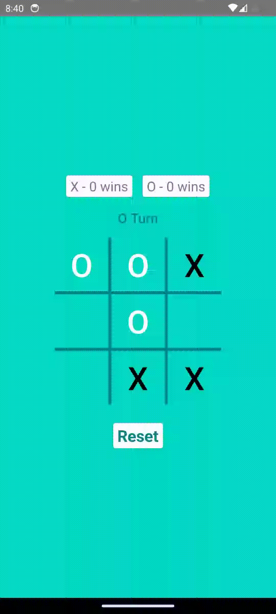

# Tic Toc Toe

In one of the interviews, I was asked to make a Tic Tac Toe game. Although, many aspects of the game 
could not be finished in the one hour span, I continued working on it after the interview finished,
and thought I should publish it on here.

We could enhance the game, as well as, the code further but I have kept it reasonably simple so that
it could be something that could be finished in an interview.

To see it working on your Android Studio, you could simply copy the code from 
[MainActivity.kt](app/src/main/java/com/ndhunju/tictactoe/MainActivity.kt) and
[activity_main.xml](app/src/main/res/layout/activity_main.xml) files

